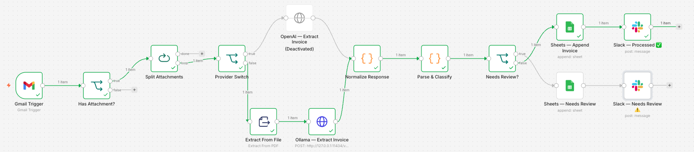

# Invoice Automation — n8n



> Automatically extract invoice data from email attachments, log it to Google Sheets, and notify your team on Slack or Teams — no manual entry, no missed invoices.

---

## English

### The problem

Your team receives invoices by email. Someone opens each PDF, reads the numbers, types them into a spreadsheet, and hopes they didn't make a typo. This takes time, introduces errors, and scales badly as invoice volume grows.

### The solution

This n8n workflow watches a Gmail inbox for incoming invoices. When a new email arrives with a PDF or image attachment, it:

1. **Extracts** structured data using an AI model — vendor, amount, dates, line items, and more
2. **Logs a row** to Google Sheets — ready for accounting or reporting
3. **Notifies your team** on Slack with a green tick, or a warning if something needs a human eye

Works with English and Japanese invoices out of the box.

> **Privacy option:** The workflow supports local AI models via [Ollama](https://ollama.com) as a drop-in alternative to cloud APIs. Invoice data never leaves your machine — ideal for clients with strict data privacy or security requirements.

---

### Architecture

```
Gmail (INBOX)
      │
      ▼
Has attachment? ── no ──▶ (skip)
      │ yes
      ▼
Split attachments  (one per file)
      │
      ▼
Provider Switch ──── openai ──▶ OpenAI GPT-4o
      │                               │
      └────────── ollama ──▶ Extract From File ──▶ Ollama (local)
                                                        │
                                               Normalize Response
                                                        │
                                               Parse & Classify
                                                        │
                  confidence=high ──▶ Sheets "Invoices"    ──▶ Slack ✅
                  confidence<high ──▶ Sheets "Needs Review" ──▶ Slack ⚠️
```



---

### What you need

| Requirement | Notes |
|---|---|
| Gmail account | For receiving invoices |
| Google Sheet | One tab: **Invoices** |
| OpenAI API key | GPT-4o. Not needed if using Ollama. |
| Slack or Teams | One channel for notifications |
| n8n | Cloud or self-hosted |
| Ollama *(optional)* | Local AI — no API key, full data privacy |

---

### Customisation

| What to change | How |
|---|---|
| Different document types (POs, receipts) | Update the extraction prompt in the AI node |
| Different email source (Outlook, IMAP) | Swap the Gmail Trigger for any n8n email trigger |
| Output to Airtable, Notion, or a database | Replace the Google Sheets nodes |
| Switch to a local AI model | Set Ollama as the provider — see [SETUP.md](./SETUP.md) |
| Stricter or looser review threshold | Edit the `needs_review` logic in the Code node |

→ **[Setup instructions](./SETUP.md)**

---

---

## 日本語

# 請求書自動化 — n8n

> Gmailに届いた請求書の添付ファイルを自動で読み取り、Googleスプレッドシートに転記。SlackやTeamsへの通知も自動で行います。手入力不要。

---

### こんなお悩みはありませんか？

メールで届く請求書をひとつひとつ開き、内容を手でスプレッドシートに入力している…そんな作業に時間をとられていませんか？入力ミスのリスクもあり、請求書の量が増えるほど負担が大きくなります。

---

### このワークフローでできること

1. **添付ファイルを自動取得** — PDFや画像に対応
2. **AIで内容を読み取る** — 請求番号・金額・日付などを自動抽出
3. **スプレッドシートに転記** — 経理・照合・レポートにすぐ使える形式で保存
4. **Slackに通知** — 処理完了は「✅」、要確認は「⚠️」

日本語・英語どちらの請求書にも対応。税込・税抜の判別、消費税率（10%/8%）の検出、インボイス番号（T+13桁）の抽出も含みます。

> **プライバシー対応：** クラウドAPIの代わりにローカルAI（Ollama）を使うことも可能です。請求書データが社外に出ないため、情報セキュリティが重要なお客様にも安心してご利用いただけます。

---

### ご用意いただくもの

| 必要なもの | 補足 |
|---|---|
| Gmailアカウント | 請求書受信用 |
| Googleスプレッドシート | 「Invoices」タブを1つ作成 |
| OpenAI APIキー | Ollamaを使う場合は不要 |
| SlackまたはTeams | 通知用チャンネル1つ |
| n8n | クラウド版またはセルフホスト |

---

### カスタマイズ例

- **対応書類の追加**（発注書、領収書など）→ AIノードのプロンプトを更新
- **出力先の変更**（Airtable、Notion、DBなど）→ GoogleSheetsノードを入れ替え
- **通知先の変更**（メール、Chatworkなど）→ Slackノードを入れ替え

ご不明な点はお気軽にご連絡ください。お客様の業務フローに合わせてカスタマイズいたします。
